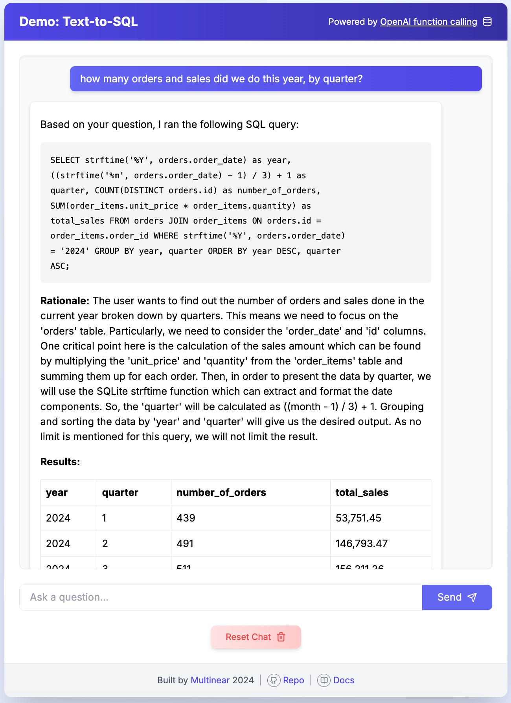

# Demo Text-to-SQL

This is a simple Text-to-SQL demo application for interacting with a complex database inspired by the Northwind database, designed for use with the [Multinear](https://multinear.com) platform.



## Introduction

This project demonstrates how to build a proof-of-concept Text-to-SQL engine that translates natural language business questions into SQL queries, executes them against a complex database, and returns the results.

The <span style="color: red">real challenge</span> is to ensure that the Text-to-SQL engine is **reliable** - generates accurate and efficient queries, handles complex database schemas, and provides meaningful insights without errors. GenAI is a powerful technology, but it's also **unpredictable by design**, and the only way to make it reliable is to build comprehensive test coverage and guardrails. 

That's exactly what the Multinear platform is for. Multinear allows developers to define evaluations in a simple yet powerful way and iteratively develop their GenAI applications, ensuring reliability and security.


## Installation

1. **Clone the Repository**

    ```bash
    git clone https://github.com/multinear-demo/demo-windforest-vanilla-py
    cd demo-windforest-vanilla-py
    ```

2. **Configure Environment Variables**

   Create a `.env` file in the root directory and add your OpenAI API key:

    ```bash
    echo "OPENAI_API_KEY=your-api-key-here" > .env
    ```

### Option 1: Using `uv` (Recommended)

[`uv`](https://github.com/astral-sh/uv) is the fastest way to run the application with minimal setup.

```bash
# Setup Environment
uv sync

# Start the Application
uv run main.py
```

### Option 2: Using `pyenv`

[`pyenv`](https://github.com/pyenv/pyenv) allows you to manage multiple Python versions and virtual environments.

```bash
# Setup Environment
pyenv install 3.9
pyenv virtualenv 3.9 text-to-sql
pyenv local text-to-sql
pip install -r requirements.txt

# Start the Application
python main.py
```

### Option 3: Using Python's built-in `venv`

```bash
# Setup Environment
python3 -m venv .venv
source .venv/bin/activate
# On Windows:
# .\.venv\Scripts\activate
pip install -r requirements.txt

# Start the Application
python3 main.py
```

Open http://127.0.0.1:8080 to see the application.

Try asking different business questions to interact with the database:

- What are the top 5 customers by sales?
- Show all orders shipped to Europe in the last quarter
- List employees with a KPI score above 4.5
- Inventory levels for bestselling books

## Tracing

Enable LLM tracing with [Arize Phoenix](https://phoenix.arize.com) in the `.env` file (see [.env.example](.env.example) and [tracing.py](tracing.py)).

---

### Jupyter Notebook

```bash
# Using uv
uv run --with jupyter jupyter lab notebook.ipynb

# Using pyenv / virtualenv
pip install jupyter
jupyter lab notebook.ipynb
```

## Architecture

Key system components:

1. [Text-to-SQL Engine](engine.py) that converts natural language questions into SQL queries using OpenAI's GPT-4, executes them against the SQLite database, and returns the results.
2. [API Server](api.py) with `FastAPI` endpoints for handling user queries.
3. [HTML](static/index.html) & [React JS](static/app.js) frontend.
4. [Data Generator](generate.py) that creates realistic and complex data inspired by the Northwind database, including customers, orders, employees, products, and more.
5. [Experiment Runner](.multinear/task_runner.py) entry point for `Multinear` platform.
6. [Configuration](.multinear/config.yaml) for evaluation tasks.

## Experimentation Platform

The platform is designed to facilitate the development and evaluation of GenAI applications through systematic experimentation.

### Running Experiments

1. **Define Tasks**

   Configure your evaluation tasks in `.multinear/config.yaml`. Each task represents a specific input scenario for the Text-to-SQL engine and defines how to evaluate the output.

2. **Execute Experiments**

   Run `Multinear` platform.

    ```bash
    # Using uv
    uv run multinear web_dev

    # Using pyenv / virtualenv
    multinear web_dev
    ```

   Open http://127.0.0.1:8000 and start experimenting.

## License

This project is licensed under the [MIT License](LICENSE).

---

<p align="center">
    <i>Built by <a href="https://multinear.com">Multinear</a>.</i>
</p>
